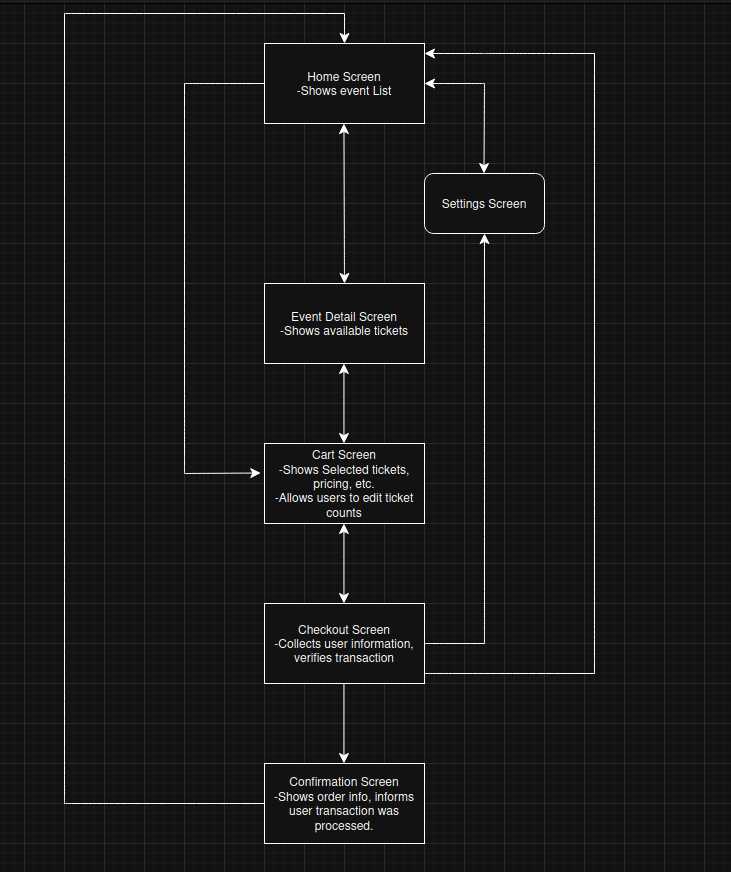

# Eventeny Take-Home Project

This is a full-stack event ticket purchasing mobile application built for the Eventeny take-home assignment. The project demonstrates my ability to design and implement a complete Flutter application with backend API integration, database design, state management, error handling, and clean architecture.

---

### Project Structure

This project consists of two separate repositories:
- Frontend (Flutter Mobile App) - [https://github.com/dausenm/eventeny_app]
- Backend (PHP API + MySQL Database) - [https://github.com/dausenm/eventeny_backend]

The backend is hosted on Railway with the backend repository to simplify the deployment of PHP services.

---

## Tech Stack

### Frontend (Flutter Mobile App)
- Flutter
- Riverpod for state management
- Provider-based ViewModel architecture
- REST API client

### Backend (API)
- PHP (REST API)
- MySQL database (hosted on Railway)

---

## Features

- Browse list of upcoming events
- Search events by name
- View event details
- Select ticket quantities and add to cart
- Checkout flow with form validation
- Full backend purchase submission
- Inventory validation on backend (prevents overselling)
- Transaction summary with confirmation screen
- Robust error handling for network and API errors
- Optimized architecture for maintainability and scalability

---

## User Flow

  - When the user launches the app, they load into the home screen, which displays a list of events pulled from a remote database.
  

  - From the home screen, we can search for a specific event, open the settings, click the home button (which refreshes events), and view the cart.
  
  
  

  

  - We can select an event to open a details page, which shows a description of the event, date and time, and what tickets are available.
  

  - Once adding tickets to the cart, we can go to our cart and check out.
  

  - After checking out, we are shown a confirmation screen and prompted to return to the home screen.
  

  - Overall App Flow Diagram
  

## Database Schema

**Tables:**

- `events (id, name, date, location, description, image_url)`
- `tickets (id, event_id, type, price, quantity_available)`
- `purchases (id, name, email, created_at)`
- `purchase_items (id, purchase_id, ticket_id, event_id, quantity, price)`

  - Entity Relationship Diagram for my DB

---

## Architecture

The app follows a clean layered structure:

- **Models**: Handle data structure
- **Services**: Handle API communication (`api_service.dart`)
- **Providers**: Riverpod state management
- **ViewModels**: Separate business logic from UI
- **Widgets / Screens**: Handle presentation layer

  - App Architecture Diagram
  
---

## Deployment

- Frontend: Flutter project runs locally or can be deployed via Flutter web.
- Backend: PHP API hosted on Railway with a connected MySQL database.
- Database: Populated with sample data for demonstration purposes.

---

## Setup Instructions

### Frontend

**Clone repository:**

- `git clone https://github.com/dausenm/eventeny_app`
- `cd eventeny_app`
- `flutter pub get`
- `flutter run`

---

### Backend

Hosted on railway. My API service in the frontend interfaces with the backend Railway service.

## Deployment

- PHP Files hosted on Railway.
- Environment Variables are used for secure DB connection via Railway-managed MySQL service.
- Frontend runs locally on your device, connects to the PHP API service for db CRUD operations.

### Notes

- Image URLs in events are sample placeholder images.
- This project is fully functional for demo purposes, but no real payment processing is implemented
- Focus was placed on
    - Clean code architecture
    - Full CRUD implementation
    - Input validation
    - Backend Integrity Checks
    - Error handling with user-friendly messages

### What I would do differently

- Spend more time researching a backend hosting service
    - I would research backend hosting providers more extensively upfront. After starting on InfinityFree (which blocked remote database API access), I migrated to Railway, which was better but introduced its own limitations — particularly, lack of SQL schema support, manual table management, and no ability to drop columns. This limited my ability to fully automate database migrations and schema updates. In a real production scenario, I would prioritize a more flexible managed backend (such as Supabase, PlanetScale, or Firebase) that provides better developer experience, stronger admin tooling, and more reliable database manipulation.

### Contact
- Dausen Mason 
- dausenmason@yahoo.com
- https://www.github.com/dausenm
- https://www.linkedin.com/in/dausenmason

### Curl Command Used for Testing
- Just dropping this here in case it comes in handy in future testing or the live demo. This command will log a purchase of 1 ticket of ticket_id 1, helps showcase error handling when someone else purchases tickets, causing your cart to become invalid.

curl -X POST https://eventenybackend-production.up.railway.app/submit_order.php \
  -H "Content-Type: application/json" \
  -d '{
    "name": "Test User",
    "email": "test@example.com",
    "cart": [
      { "event_id": 1, "ticket_id": 1, "quantity": 1, "price": 25.00 }
    ]
  }'
